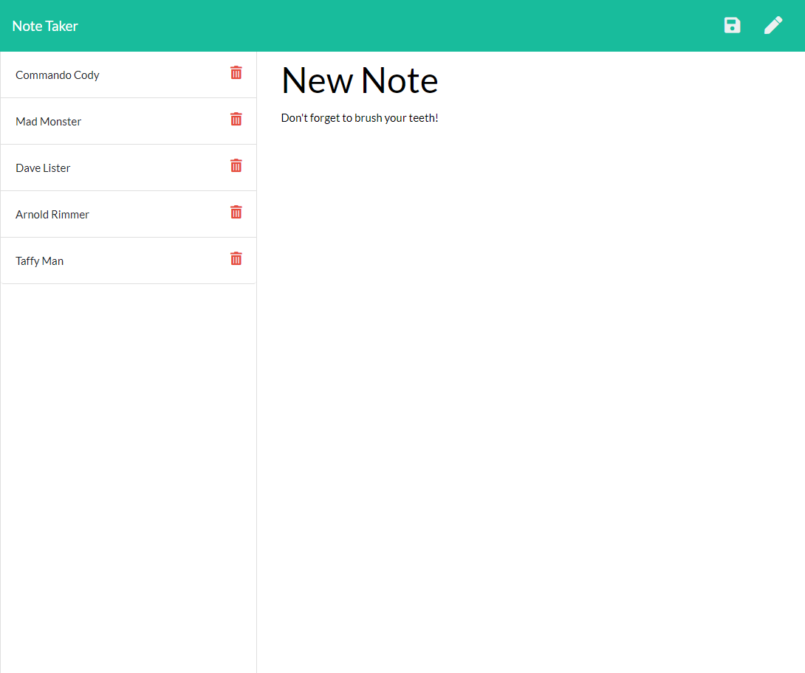

# Amanuensis

---------------------------------------

## Description
This is an app for writing, saving and deleting notes in a simple and convienient way!

---------------------------------------

Project Link: 
[Note Taker](https://sheltered-crag-78743.herokuapp.com/)

---------------------------------------

---------------------------------------

Written using:

                    
* JavaScript
   
* HTML
   
* ES6
   
* Node
 
---------------------------------------

## Questions

For any input, concerns, bugs or questions please get in touch!  Simply reach out to [Nina Cummings](https://github.com/jaderiver62/amanuensis/tree/main) via GitHub or via e-mail: jaderiver64@gmail.com.

---------------------------------------

## Licence

#### This project is licensed under the [MIT License](https://opensource.org/licenses/MIT).
#### &copy; 2021 Nina Cummings

---------------------------------------
    